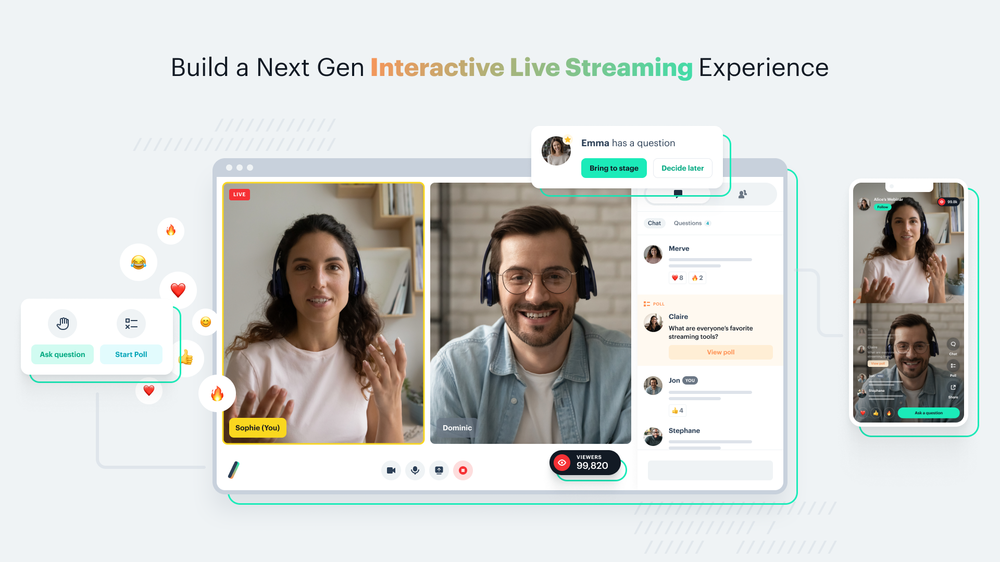
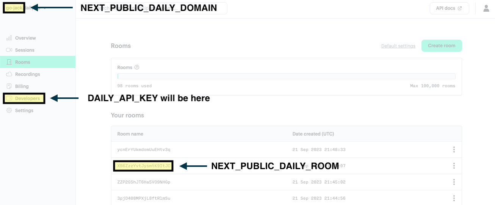

# Interactive Live Streaming (aka ILS) Demo with [Daily](https://www.daily.co/products/interactive-live-streaming)



Daily Interactive Live Streaming (ILS) is the next generation of large video experiences. Host real-time streams with up to 100,000 viewers and 25 speakers interacting **at under 200ms latency**. Build better webinars, live classes, creator streams, live commerce, town halls and any large experience.

This demo features a NextJS + Typescript implementation that showcases Daily's ILS and includes support for:

- 'Bring-to-stage' role promotion flow from viewer to speaker
- Two-way chat support between viewers and speakers
- Support for reactions, polls, and recording

### Live example

**[See it in action here ➡️](https://daily-ils.vercel.app/)**

---

## Getting Started

### Create Daily Room

We are creating the room via Daily's [REST API](https://docs.daily.co/reference/rest-api/rooms/create-room),
we need Daily's API Key to process this request, you can get the API Request from the Daily [Dashboard](https://dashboard.daily.co/developers).

Replace `$TOKEN` with API token

```
curl -H "Content-Type: application/json" \
  -H "Authorization: Bearer $TOKEN" \
  -XPOST -d \
  '{"properties":{"permissions": { "canSend": false, "hasPresence": false }}}' \
  https://api.daily.co/v1/rooms/
```

### Install dependencies

```
yarn install

# Enable husky
yarn husky install
```

### Copy & update the env variables

You'll find `DAILY_API_KEY` in your [Daily dashboard](https://dashboard.daily.co/developers). `NEXT_PUBLIC_DAILY_DOMAIN` is the subdomain for your account; for example, `[YOUR_DOMAIN].daily.co`. `NEXT_PUBLIC_DAILY_ROOM` should be the room you've created, either via the REST API or through your Daily dashboard.



```
# set DAILY_API_KEY, NEXT_PUBLIC_DAILY_DOMAIN & NEXT_PUBLIC_DAILY_ROOM
cp env.example .env.local
```

### Start your dev server

```
yarn dev
```

Demo should be live at - http://localhost:3000

## Deploy your own on Vercel

[](https://vercel.com/new/clone-flow?repository-url=https%3A%2F%2Fgithub.com%2Fdaily-solutions%2Fils.git&env=NEXT_PUBLIC_DAILY_DOMAIN%2CNEXT_PUBLIC_DAILY_ROOM%2CDAILY_API_KEY)
